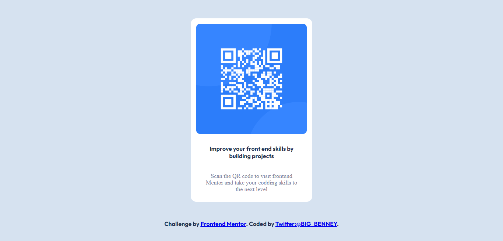

# Frontend Mentor - QR code component solution

This is a solution to the [QR code component challenge on Frontend Mentor](https://www.frontendmentor.io/challenges/qr-code-component-iux_sIO_H). Frontend Mentor challenges help you improve your coding skills by building realistic projects. 

## Table of contents

- [Overview](#overview)
  - [Screenshot](#screenshot)
  - [Links](#links)
- [My process](#my-process)
  - [Built with](#built-with)
  - [What I learned](#what-i-learned)
  - [Continued development](#continued-development)
  - [Useful resources](#useful-resources)
- [Author](#author)
- [Acknowledgments](#acknowledgments)


## Overview

The task from frontendmentor.io was to create a QR code component card. this document provides a detailed explanation of methodology and technologies used at different points; from inception to finalization of this project in order to achieve this end-result.

### Screenshot




### Links

- Solution URL: [Add solution URL here](https://your-solution-url.com)
- Live Site URL:(https://gleaming-brioche-3dc17d.netlify.app/)

## My process

I started off by creating the basic structure of this project using HTML, then i gradually added style components to it using  custom CSS properties and the Guidelines provided in the style-guide.md document. I then created a repository for this project on github and finally diployed it to the web from the repository through Netlify.   


### Built with

- Semantic HTML5 markup
- CSS custom properties

### What I learned

I intially had problem attaching the fonts provided in the style-guide.md document to the both the HTML document as a link in the head section and also declearing the font using the @font-face rule in the Stylesheet. I was able to figure it  out after doing some Googling:

```html
<link href="https://fonts.googleapis.com/css2?family=Outfit:wght@700&display=swap" rel="stylesheet">
```
```css
@font-face {
    font-family: 'Outfit', sans-serif;
    src: url(https://fonts.google.com/specimen/Outfit);
}
```

### Continued development
 I want to get better at CSS Layouts like Grid, Flexbox and also Responsive web design in the future


## Author

- Frontend Mentor - [@yourusername](https://www.frontendmentor.io/profile/NtajiBenbor)
- Twitter - [@yourusername](https://www.twitter.com/BIG_BENNEY)

## Acknowledgments

I want to thank myself for sticking through this and finally finishing it. It is a testement of my will and determination to become a web developer. Thank you for taking these small baby steps.
